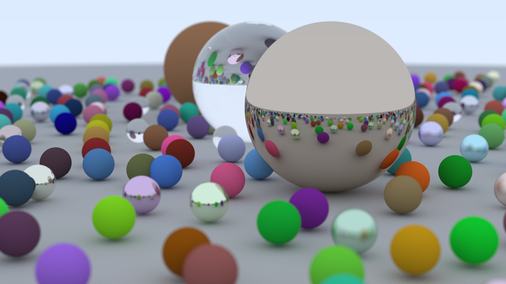

# PathTracer

## Description

This is a path tracer written in C++ based on the book *Ray Tracing in One Weekend* by Peter Shirley. It has been
extensively adapted to leverage modern C++23 features and architected for high performance, modularity, and
extensibility. It moves beyond the foundational text by implementing a production-style iterative rendering loop, a
highly optimized acceleration structure, thread-stealing concurrency, and real-time asynchronous window display.

## Features

**Architecture & Performance [Custom Engine Upgrades]**

* **Custom BVH:** Built with the Surface Area Heuristic (SAH) using iterative, front-to-back traversal and division-free
  AABB intersections.
* **Intel TBB Multithreading:** Tile-based rendering for CPU cache locality, using lock-free `thread_local` RNGs to
  eliminate thread contention.
* **Iterative Tracing:** Bounces and scattering use a flat loop with attenuation tracking to prevent call-stack bloat
  from deep recursion.

**Rendering & Optics**

* **Materials:** Lambertian (diffuse), Metal (reflective with fuzz), and Dielectric (glass using Schlick's
  approximation).
* **Cinematic Camera:** Positionable perspective camera with depth of field (defocus blur) and adjustable FOV.
* **Image Processing:** Multi-sampled anti-aliasing (MSAA) and automatic linear-to-gamma correction.

**Interface & Output [Custom Engine Upgrades]**

* **Real-Time Display:** Live, non-blocking viewport powered by SDL3, alongside traditional offline `.ppm` exports.
* **CLI Configuration:** Robust runtime customization (threads, bounces, samples, etc.) via `cxxopts`.

## Default Scene Render



## Performance Benchmarks

To measure the impact of the architectural upgrades, the engine was benchmarked rendering the complex "Final Scene" 
(1200x675 resolution, 500 samples per pixel, 50 max bounces) on an **AMD Ryzen 7 7800X3D** CPU (8 cores, 16 threads).

*Note: The "Baseline" measurement below is already faster than the vanilla textbook implementation. Using a profiler,
the baseline was stripped of bottlenecks, such as replacing deep recursion with an iterative loop, eliminating atomic
`shared_ptr` reference-counting inside the hot intersection loop, and using std::variant with the visitor pattern (as
described in [this](https://www.youtube.com/watch?v=PEcy1vYHb8A&t=1811s) CppCon talk).

| Architecture Phase                                                           | Render Time | Speedup (vs Baseline) |
|:-----------------------------------------------------------------------------|:------------|:----------------------|
| **1. Optimized Baseline** <br>*(Single-threaded, O(N) linear intersections)* | 13m 15.56s  | 1.0x                  |
| **2. Concurrency** <br>*(Intel TBB Multithreading & Tile Dispatch)*          | 1m 36.99s   | **~8.2x**             |
| **3. Acceleration** <br>*(TBB + SAH Bounding Volume Hierarchy)*              | **16.99s**  | **~46.8x**            |

## Build

Pre-requisites:

- An AVX2 compatible CPU if using MSVC (if you don't have one, remove the /arch:AVX2 flag from the CMake presets)
- CMake (>= 3.29)
- Ninja
- C++-23 compatible compiler (ideally msvc or clang on windows/clang on linux)
- On Linux if using clang: `clang-tools`, `libc++-dev`, `libc++abi-dev`
- On Linux, the prerequisites at [this link](https://github.com/libsdl-org/SDL/blob/release-3.2.x/docs/README-linux.md)
  for the SDL3 library.

You can build the project automatically using JetBrains CLion, Windows Visual Studio (Code), or manually using CMake.
To build manually with CMake, run the following commands (for the example preset `windows-clang-release`) in the project
root directory. This does not work with the `windows-msvc` presets, as they require the Visual Studio generator. You may
be able to run the commands in a Visual Studio Developer Command Prompt, but this has not been tested.

```bash
cmake --preset "windows-clang-release"
cd out/build/windows-clang-release
cmake --build .
```

The available presets can be seen in the `CMakePresets.json` file.

## Run

### Rendering the default scene

To run the path tracer and generate the default scene, execute the following command in the build directory.
It will render the image in a separate window in real time.

#### In Linux

```bash
./PathTracer
```

#### In Windows (PowerShell)

```bash
./PathTracer.exe
```

### Rendering into a PPM file

To render the image into a PPM file, run the following command, specifying your own output file if necessary, as shown
below:

#### In Linux

```bash
./PathTracer -m ppm -o file.ppm
```

#### In Windows (PowerShell)

```bash
./PathTracer.exe -m ppm -o file.ppm
```

### Other options

To see the list of all the other configurable options (including image width, maximum number of threads, and various ray
tracing parameters), use:

#### In Linux

```bash
./PathTracer -h
```

#### In Windows (PowerShell)

```bash
./PathTracer.exe -h
```

## Command-Line Arguments

The application exposes several parameters to tune performance and rendering quality at runtime.

| Flag | Name                  | Default      | Description                                                                              |
|:-----|:----------------------|:-------------|:-----------------------------------------------------------------------------------------|
| `-m` | `--output-mode`       | `window`     | The output mode for the renderer (`window` or `ppm`).                                    |
| `-t` | `--max-threads`       | `0`          | Maximum threads for rendering. `0` for auto-detect, or specify an exact integer.         |
| `-o` | `--ppm-output`        | `output.ppm` | The destination file path when using the `ppm` output mode.                              |
| `-w` | `--width`             | `1200`       | The width of the resulting image in pixels (height is auto-calculated via aspect ratio). |
| `-b` | `--max-bounces`       | `50`         | The maximum number of light bounces per ray.                                             |
| `-p` | `--samples-per-pixel` | `500`        | The number of ray samples evaluated per pixel for anti-aliasing.                         |
| `-s` | `--tile-size`         | `16`         | The dimension of each square tile rendered by a thread.                                  |
| `-h` | `--help`              | N/A          | Prints the usage information and argument list.                                          |
