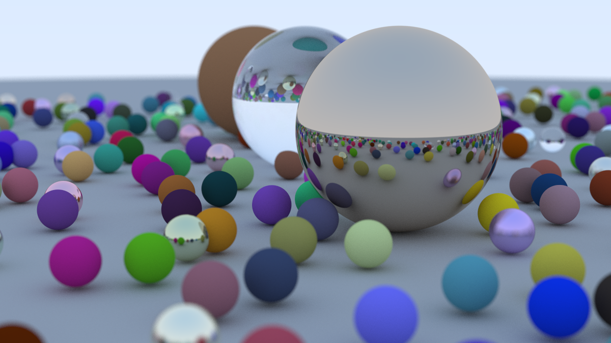

# PathTracer

## Description

This is a simple path tracer written in C++ based on the book "Ray Tracing in One Weekend" by Peter Shirley.
It has been adapted by me to use modern C++ features and to be more performant, modular and extensible.
New features include multithreaded rendering and displaying the image in a window with real-time updates.

## Features

**Entities:** Spheres\
**Materials:** Lambertian (diffuse), Dielectric (transparent), Metal (reflective)\
**Scenes:** Two scenes provided in `World.h`\
**Camera:** Positionable camera with adjustable field of view\
**Performance:** Implements multithreading using the Intel TBB library.\
**Display:** Real-time updates with the SDL3 library.

## Default Scene Render



## Build

Pre-requisites:

- CMake (>= 3.29)
- C++-23 compatible compiler (ideally msvc or clang on windows/clang on linux)
- On Linux if using clang: `clang-tools`, `libc++-dev`, `libc++abi-dev`
- On Linux, the prerequisites at [this link](https://github.com/libsdl-org/SDL/blob/release-3.2.x/docs/README-linux.md) for the SDL3 library.

You can build the project automatically using JetBrains CLion, Windows Visual Studio (Code), or manually using CMake.
To build manually with CMake, run the following commands (for the example preset `windows-clang-release`) in the project
root directory:

```bash
cmake --preset "windows-clang-release"
cd out/build/windows-clang-release
cmake --build .
```

The available presets can be seen in the `CMakePresets.json` file.

## Run

### Rendering the default scene

To run the path tracer and generate the default scene, execute the following command in the build directory.
It will render the image in a separate window in real time.

#### In Linux

```bash
./PathTracer
```

#### In Windows (PowerShell)

```bash
./PathTracer.exe
```

### Rendering into a PPM file

To render the image into a PPM file, run the following command, specifying your own output file if necessary, as shown below:

#### In Linux

```bash
./PathTracer -m ppm -o file.ppm
```

#### In Windows (PowerShell)

```bash
./PathTracer.exe -m ppm -o file.ppm
```

### Other options

To see the list of all the other configurable options (including image width, maximum number of threads, and various ray tracing parameters), use:

#### In Linux

```bash
./PathTracer -h
```

#### In Windows (PowerShell)

```bash
./PathTracer.exe -h
```
